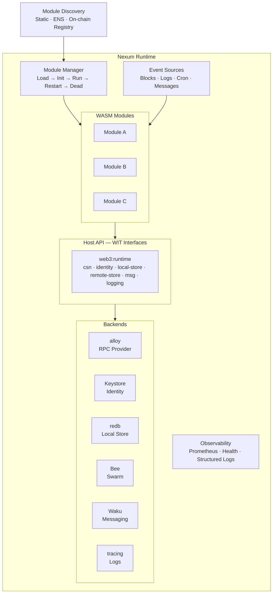
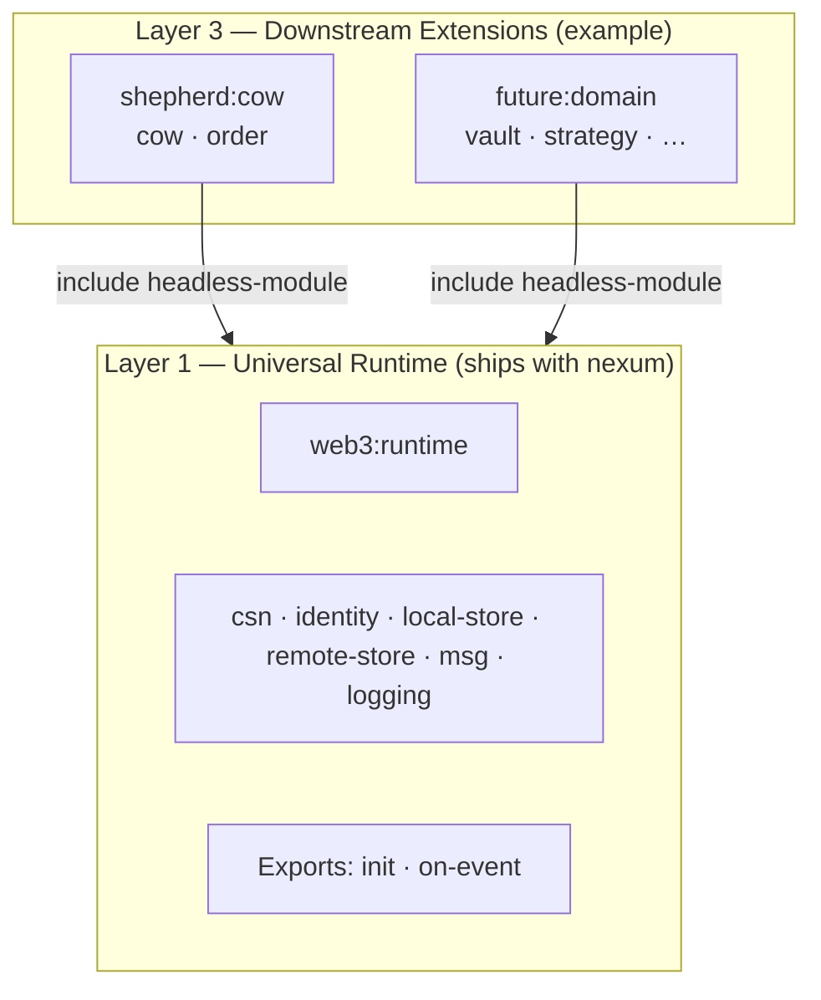
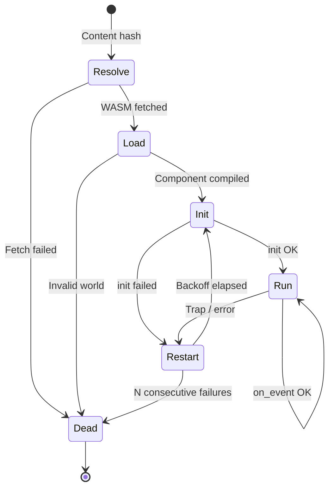

# Nexum Runtime: Universal WASM Component Model Runtime

Nexum is a WASM Component Model runtime that provides secure, sandboxed execution for WebAssembly modules. Modules react to blockchain events, read chain state, persist data locally and to decentralised storage, communicate via decentralised messaging — all within a capability-based sandbox with zero implicit permissions.

A module compiled against the universal `web3:runtime/headless-module` world runs on any Nexum-compatible host. Downstream distributions can add protocol-specific WIT packages on top of the universal interfaces — for example, **Shepherd** is a Nexum-based distribution that layers a CoW Protocol extension (`shepherd:cow` WIT package) over the universal primitives that nexum ships with.

## Architecture



## Design Principles

- **Component Model from day 1** — WIT-defined API contract; structural sandboxing (no WASI, no FS, no network); multi-language guests.
- **Declarative subscriptions** — modules declare events in their manifest; the runtime wires sources.
- **Transactional state** — per-event all-or-nothing semantics; commit on success, rollback on trap.
- **Content-addressed distribution** — modules are fetched by hash (Swarm, IPFS, OCI, HTTPS); integrity always verified.
- **Self-hosted** — no centralised dependency; operator runs their own node.

## The Six Primitives

Every module has access to six orthogonal capabilities through the `web3:runtime` WIT package:

| Primitive | Interface | Purpose | Scope | Backend (Server) |
|-----------|-----------|---------|-------|-------------------|
| **Consensus** | `csn` | Read/write blockchain state via JSON-RPC | Global (per chain) | alloy Provider |
| **Identity** | `identity` | Key management and message signing | Per-account | Keystore / KMS / HSM |
| **Local Store** | `local-store` | Per-module key-value persistence | Device-local, per-module | redb |
| **Remote Store** | `remote-store` | Decentralised content-addressed storage | Global (content-addressed) | Ethereum Swarm |
| **Messaging** | `msg` | Decentralised pub/sub messaging | Topic-based | Waku |
| **Logging** | `logging` | Diagnostic output | Per-module | tracing |

These primitives are orthogonal:

- **Consensus** is the source of truth — the blockchain. Modules read chain state and (indirectly) write to it via order submission or transactions.
- **Identity** is cryptographic identity — key management and signing. The `csn` host implementation depends on `identity` internally: signing RPC methods (`eth_sendTransaction`, `eth_accounts`, `eth_signTypedData_v4`, `personal_sign`) delegate to the identity backend. Modules can also import `identity` directly for raw signing operations.
- **Local Store** is the module's private scratchpad — fast, local, scoped to one module on one device. Does not replicate.
- **Remote Store** is shared persistent content — content-addressed, decentralised, survives independent of any device. Any module on any device can read what another module wrote.
- **Messaging** is real-time communication — ephemeral pub/sub messages between modules, devices, or users. Transient and topic-based.
- **Logging** is diagnostics — one-way output for debugging and monitoring. Not a data channel.

## WIT Worlds

Nexum ships the universal `web3:runtime` WIT package. Domain-specific distributions layer additional WIT packages on top via `include`.



```
// Universal layer — any platform, any blockchain app
package web3:runtime@0.1.0

world headless-module {
    import csn            — consensus access (JSON-RPC passthrough)
    import identity       — key management and message signing
    import local-store    — local key-value persistence
    import remote-store   — decentralised storage (Swarm)
    import msg            — decentralised messaging (Waku)
    import logging        — log (trace/debug/info/warn/error)

    export init(config)   — called once on load
    export on_event(event)— called per subscribed event (block, logs, timer, message)
}
```

No WASI interfaces are imported. All I/O is mediated through host interfaces. The `csn` interface exposes a single generic `request` function — the SDK implements alloy's `Transport` trait on top of it, giving modules the full alloy `Provider` API (80+ methods) with zero WIT churn. The `identity` interface provides key management and signing — `csn` depends on it internally for signing RPC methods, and modules can also use it directly.

> Design rationale: [07-rpc-namespace-design.md](./07-rpc-namespace-design.md) | Platform generalisation: [08-platform-generalisation.md](./08-platform-generalisation.md)

-> Full WIT definition: [01-runtime-environment.md](./01-runtime-environment.md)

## Technology Stack

| Concern | Choice | Version |
|---------|--------|---------|
| Language | Rust | 1.94+ |
| WASM runtime | wasmtime (Component Model) | 41.x |
| API contract | WIT (`web3:runtime@0.1.0`) | — |
| Guest bindings | wit-bindgen | 0.53.x |
| Async | Tokio | — |
| Ethereum RPC | alloy | 1.5.x |
| Local store | redb | 3.1.x |
| Logging | tracing + tracing-subscriber | — |
| Metrics | metrics + metrics-exporter-prometheus | — |
| Deployment | Docker | — |
| License | AGPL-3.0-or-later | — |

## Module Package

A module ships as a **bundle**: a manifest (`nexum.toml`) plus a compiled WASM component.

```toml
# nexum.toml
[module]
name = "block-logger"
version = "0.2.0"
wasm = "sha256:9f86d081…"       # content hash of module.wasm

[module.resources]
max_memory_bytes = 10_485_760    # 10 MB
max_fuel_per_event = 100_000
max_state_bytes = 52_428_800     # 50 MB

[chains]
required = [1]                   # must have RPC for these chains

[[subscribe]]
type = "block"
chain_id = 1

[config]
log_prefix = "block"
```

The manifest declares identity, resource caps, chain requirements, event subscriptions, and opaque module config — everything the runtime needs to load and run the module.

-> Full spec: [02-modules-events-packaging.md](./02-modules-events-packaging.md)

## Module Discovery

Three layers, from simplest to most decentralised:

| Method | How it works |
|--------|-------------|
| **Static** | Operator points at a local manifest path |
| **ENS** | Module author sets ENS `contenthash` (ENSIP-7) to a Swarm/IPFS reference; runtime resolves and fetches |
| **On-chain registry** | Runtime watches contract events or ENS `TextChanged` events for module registrations |

All methods converge: resolve content reference -> fetch via content store -> verify hash -> load.

-> Full design: [03-module-discovery.md](./03-module-discovery.md)

## Module Lifecycle



- **Resolve**: fetch WASM by content hash from Swarm/IPFS/OCI/local.
- **Load**: compile `Component`, validate WIT world, create `InstancePre`.
- **Init**: create `Store`, instantiate, call `init(config)`.
- **Run**: dispatch subscribed events to `on_event`. Each call gets a fuel budget.
- **Restart**: on crash — exponential backoff (1s -> 5min cap), fresh `Store`, state persists.
- **Dead**: after N consecutive failures (poison pill) — requires manual intervention.

-> Full lifecycle: [02-modules-events-packaging.md](./02-modules-events-packaging.md)

## Event System

- **Sources**: `block` (new heads via `eth_subscribe`), `log` (filtered contract events), `cron` (schedule-based), `message` (Waku content topics).
- **Shared subscriptions**: one block subscription per chain, fanned out to all subscribed modules.
- **Dispatch**: concurrent across modules, sequential within a module (ordered delivery).
- **Declared in manifest**: `[[subscribe]]` blocks — the runtime wires sources, not the module.

-> Full design: [02-modules-events-packaging.md](./02-modules-events-packaging.md)

## Local Store

- **Backend**: redb (pure Rust, ACID, MVCC, crash-safe).
- **Isolation**: one database file per module; modules cannot access each other's state.
- **Transactions**: each `on_event` runs in an implicit write transaction — commit on success, rollback on failure.
- **Survives restarts**: state is external to WASM instance.
- **Size enforcement**: `max_state_bytes` from manifest, enforced host-side.
- **Prefix scanning**: `list-keys(prefix)` for namespaced key organisation.

-> Full design: [04-state-store.md](./04-state-store.md)

## SDK

The `nexum-sdk` crate is the universal Rust SDK for any module targeting `web3:runtime/headless-module`.

| Crate | Provides |
|-------|----------|
| `nexum-sdk` | `provider(chain_id)` — full alloy `Provider` backed by host RPC via `HostTransport` |
| | `Identity` — signing client (get accounts, sign messages, sign EIP-712 typed data) |
| | `TypedState` — serde-based typed local state (postcard serialisation) |
| | `RemoteStore` — typed decentralised storage client (upload, download, feeds) |
| | `MsgClient` — typed messaging client (publish, query) |
| | `abi::sol!` — compile-time Ethereum ABI codec (alloy-sol-types) |
| | `log::{info!, …}` — formatted logging macros |
| | `Error` / `Result` — proper error type with `?` support |
| | `#[nexum::module]` — proc macro for universal modules |
| | `testing::MockHost` — native-Rust unit tests with mock host |
| | `testing::WasmTestHarness` — integration tests in real wasmtime |
| | `cargo nexum` — CLI: new / build / package / publish |

Downstream distributions layer their own SDK on top. For example, Shepherd ships `shepherd-sdk`, which re-exports `nexum-sdk` and adds a typed `CowClient`, a `#[shepherd::module]` proc macro, and CoW Protocol–specific testing utilities.

Multi-language support: module authors can use Rust, C/C++, Go, JavaScript, or Python — all compile to valid components against the same WIT world.

-> Full design: [05-sdk-design.md](./05-sdk-design.md)

## Production Hardening

### Resource Enforcement

| Resource | Mechanism | On breach |
|----------|-----------|-----------|
| CPU (deterministic) | Fuel | Trap -> rollback -> restart |
| CPU (wall-clock) | Epoch interruption | Yield to Tokio |
| Memory | `ResourceLimiter` | `memory.grow` denied |
| Storage | Host-side tracking | `local-store::set` returns `Err` |

### RPC Resilience

Tower layer stack per chain: timeout -> retry (exponential + jitter) -> rate limit -> fallback endpoint. WebSocket subscriptions auto-reconnect with missed-block backfill.

### Observability

| Signal | Stack | Endpoint |
|--------|-------|----------|
| Logs | `tracing` -> JSON | stdout |
| Metrics | `metrics` -> Prometheus | `:9090/metrics` |
| Health | HTTP JSON | `:8080/health` |

Metrics cover three groups: runtime-level (modules loaded/dead), per-module (events, latency, fuel, restarts, state usage), per-chain RPC (requests, errors, fallbacks, blocks behind).

-> Full design: [06-production-hardening.md](./06-production-hardening.md)

## Platform Generalisation

The WIT contract is the universal interface — any host that implements it can run modules unchanged. The architecture generalises beyond the server runtime to four platform targets:

| Platform | WASM Engine | Local Store | RPC Backend | Use Case |
|----------|-------------|-------------|-------------|----------|
| **Server** (reference) | wasmtime | redb | alloy provider | Headless automation |
| **Mobile** (Flutter/Dart) | wasmtime C API / wasm3 | SQLite | HTTP client | On-device automation |
| **WebView** | Browser engine + `jco` | IndexedDB | JS bridge / wallet | Rich web UIs |
| **Super app** | All of the above | SQLite | HTTP + wallet | Decentralised mini-programs |

-> Full design: [08-platform-generalisation.md](./08-platform-generalisation.md)

## Repository Structure

```
nexum/
├── crates/
│   └── nexum/
│       └── runtime/        Core WASM host (server), event system, local store
├── modules/
│   └── example/            Example universal WASM module
├── wit/
│   └── web3-runtime/       Universal WIT package (csn, identity, local-store, remote-store, msg, logging)
└── docs/
    └── runtime/
        ├── 00-overview.md
        ├── 01-runtime-environment.md
        ├── 02-modules-events-packaging.md
        ├── 03-module-discovery.md
        ├── 04-state-store.md
        ├── 05-sdk-design.md
        ├── 06-production-hardening.md
        ├── 07-rpc-namespace-design.md
        └── 08-platform-generalisation.md
```
