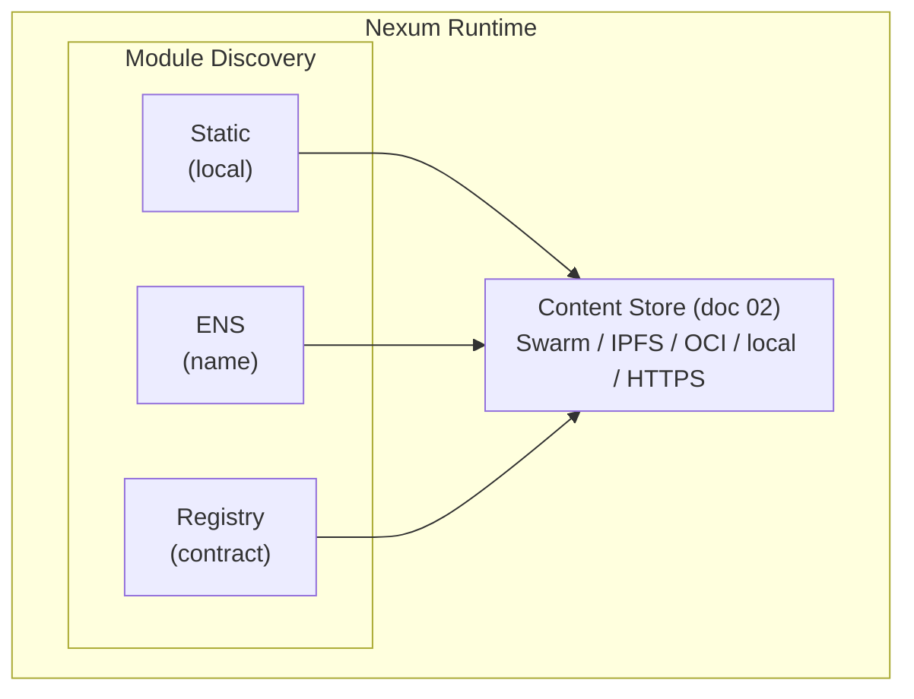
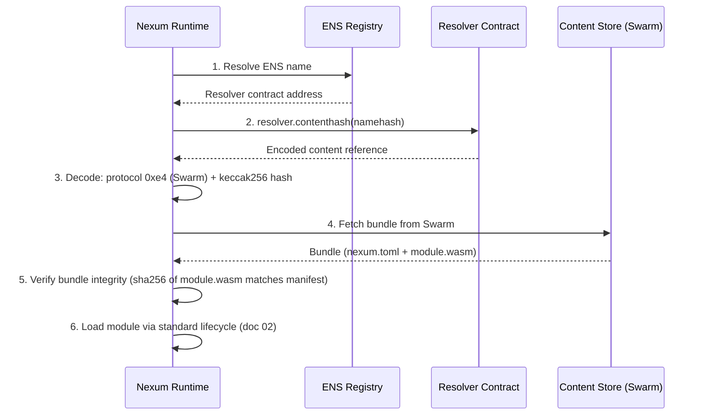
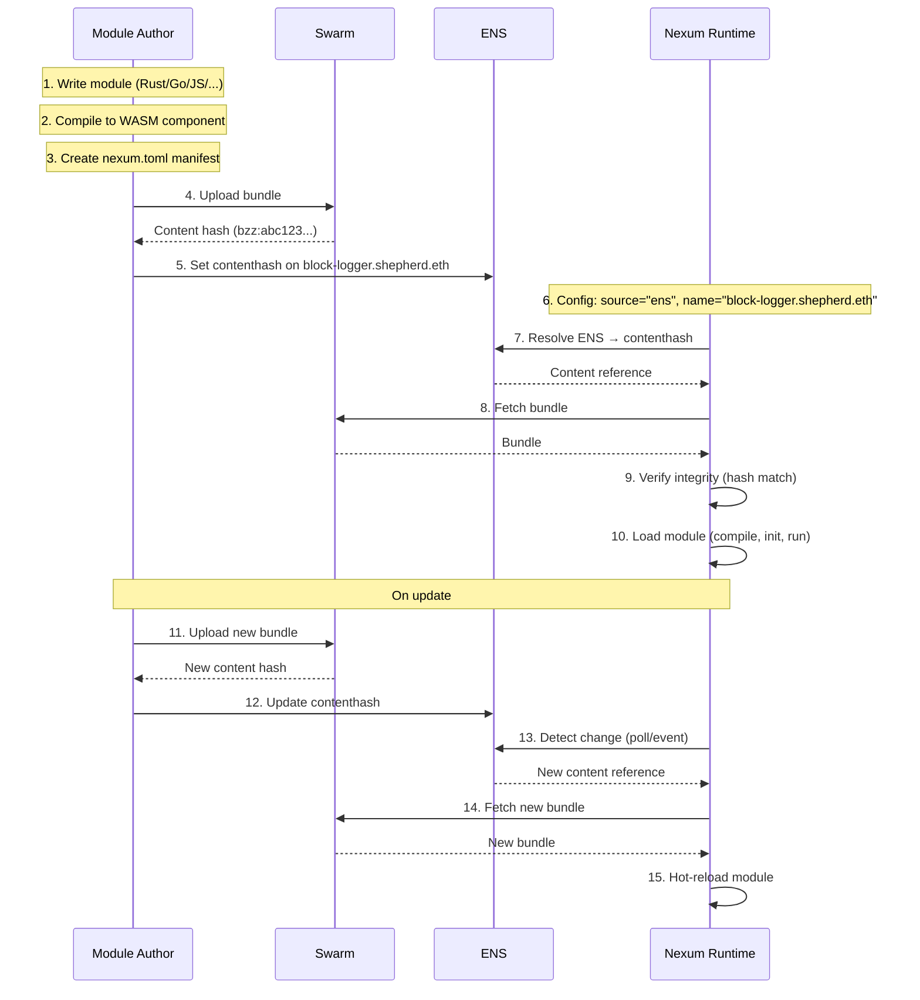

# Module Discovery

Doc 02 defines how modules are packaged (bundle = `nexum.toml` + `module.wasm`) and how content is fetched by hash (pluggable content store). This document defines how the runtime **discovers which modules to load** — the layer above content resolution.

> The ENS names and contract addresses in this document are illustrative examples. They show the naming patterns a downstream distribution (such as Shepherd, which builds on nexum for CoW Protocol automation) might adopt, but they are not reserved or owned by nexum itself.

Three discovery sources, from simplest to most decentralised:



## 1. Static (local path)

Operator points the runtime at a local manifest. No on-chain interaction.

```toml
[[modules]]
source = "static"
manifest = "/var/nexum/block-logger/nexum.toml"
```

Use case: local development, air-gapped deployments, CI testing.

## 2. ENS Name Resolution

A module author publishes their bundle to Swarm (or IPFS) and associates it with an ENS name. The runtime resolves the name to a content reference, fetches the bundle, and loads it.

### How it works

ENS already has native support for content-addressed storage:

- **`contenthash`** (ENSIP-7 / EIP-1577): binary field that encodes a protocol code + content hash. Swarm is protocol `0xe4`, IPFS is `0xe3`. This is the primary pointer to the bundle.
- **Text records** (ENSIP-5 / EIP-634): arbitrary key-value UTF-8 strings. Applications use reverse-domain keys to avoid collisions.

A module author sets up their ENS name (the following is an illustrative example using a fictional publisher namespace):

```
block-logger.shepherd.eth
├── contenthash  →  0xe40101fa011b20{32-byte-keccak256}
│                   (Swarm reference to the bundle)
├── text: shepherd.version  →  "0.2.0"
├── text: shepherd.chains   →  "1"
└── text: shepherd.name     →  "block-logger"
```

The `contenthash` points to the full bundle on Swarm (a directory containing `nexum.toml` + `module.wasm`). Text records provide lightweight metadata the runtime can read without fetching the bundle — useful for filtering or display.

### Runtime resolution flow



### Runtime config

```toml
[[modules]]
source = "ens"
name = "block-logger.shepherd.eth"
chain_id = 1                         # which chain to resolve ENS on
poll_interval = "5m"                 # check for updates

[[modules]]
source = "ens"
name = "price-alert.shepherd.eth"
chain_id = 1
poll_interval = "5m"
```

### Updates

When the module author publishes a new version, they:
1. Upload the new bundle to Swarm → get new content hash
2. Update the ENS `contenthash` record

The runtime detects the change on its next poll (or via event — see below), fetches the new bundle, and hot-reloads the module.

## 3. On-Chain Registry (Contract Events)

For fully autonomous discovery — the runtime watches a contract for registration events and auto-loads modules without operator intervention.

### Option A: Dedicated registry contract

A simple contract where module authors register their ENS name:

```solidity
// SPDX-License-Identifier: AGPL-3.0
pragma solidity ^0.8.0;

interface INexumRegistry {
    event ModuleRegistered(
        string indexed ensNameHash,
        string ensName,
        address indexed registrant
    );
    event ModuleRemoved(
        string indexed ensNameHash,
        string ensName
    );

    function register(string calldata ensName) external;
    function remove(string calldata ensName) external;
}
```

The runtime subscribes to `ModuleRegistered` events, resolves the ENS name from the event, and enters the ENS resolution flow above.

### Option B: No ad-hoc registry — contracts self-declare via ENS

This is the more decentralised approach. Instead of a central registry:

1. **Any contract** can associate itself with a nexum module by setting a text record on its own ENS name.
2. The runtime watches for `TextChanged` events on the ENS Public Resolver filtered to a reverse-domain key (e.g. `shepherd.module` for a downstream distribution, or any other key that a particular deployment chooses to watch).

For example, a downstream CoW Protocol distribution could set, on `composablecow.cow.eth`:

```
composablecow.cow.eth
├── text: shepherd.module  →  "twap-monitor.shepherd.eth"
```

This says: "the downstream module for this contract lives at `twap-monitor.shepherd.eth`".

The runtime can either:
- **Poll** known ENS names for a chosen text record key.
- **Watch** `TextChanged` events on the ENS resolver, filtered to that key:

```
event TextChanged(
    bytes32 indexed node,
    string indexed indexedKey,
    string key,      // e.g. "shepherd.module"
    string value     // e.g. "twap-monitor.shepherd.eth"
);
```

### Option C: Wildcard subdomain registry (ENSIP-10)

A parent name like `modules.shepherd.eth` uses wildcard resolution (ENSIP-10). A resolver contract serves subdomains dynamically:

```
block-logger.modules.shepherd.eth     → contenthash of the bundle
price-alert.modules.shepherd.eth      → contenthash of another bundle
*.modules.shepherd.eth                → resolved by registry contract
```

The wildcard resolver is itself the registry — anyone can register a subdomain. The runtime subscribes to events from the resolver contract to discover new modules.

This gives us human-readable, permissionless module discovery under a shared namespace.

### Runtime config for registry discovery

```toml
[[modules]]
source = "registry"
contract = "0x1234…"              # registry contract address
chain_id = 1
# All modules registered here are auto-loaded

[[modules]]
source = "ens-watch"
resolver = "0x231b…"              # ENS Public Resolver
chain_id = 1
text_key = "shepherd.module"
# Watch for any ENS name that sets this text record
```

## Layered Trust Model

Discovery is permissionless, but **execution requires operator consent**. The runtime config controls what gets auto-loaded:

```toml
[discovery]
# "allowlist" — only load modules from these sources
# "auto" — load anything discovered (use with caution)
mode = "allowlist"

# If mode = "allowlist", only these ENS names / registries are trusted
allowed_ens_names = [
    "block-logger.shepherd.eth",
    "price-alert.shepherd.eth",
]
allowed_registries = [
    "0x1234…"
]

# Resource caps applied to ALL discovered modules (override manifest if lower)
[discovery.resource_limits]
max_memory_bytes = 10_485_760
max_fuel_per_event = 100_000
```

In `auto` mode, the runtime loads any module it discovers (useful for a public node running all modules under a given namespace). In `allowlist` mode, discovered modules are staged for operator review.

## ENS Name Conventions

Suggested naming under a shared parent (e.g. a namespace owned by a downstream distribution, or a subdomain of a protocol):

```
<module-name>.<publisher>.eth       — community / independent modules
<module-name>.<protocol>.eth        — protocol-owned modules

Examples:
  block-logger.shepherd.eth
  price-alert.shepherd.eth
  rebalancer.shepherd.eth
  twap.cow.eth
```

## How the Pieces Fit Together



## Summary

| Discovery Method | Decentralisation | Operator Effort | Use Case |
|-----------------|------------------|-----------------|----------|
| Static (local path) | None | Manual | Dev, CI, air-gapped |
| ENS (named) | High | Configure names | Production, known modules |
| Registry (contract) | Full | Point at contract | Public nodes, auto-discovery |
| ENS self-declare | Full | Watch resolver | Protocol-native automation |

All methods converge on the same flow: resolve a content reference → fetch via content store → verify → load via module lifecycle.
