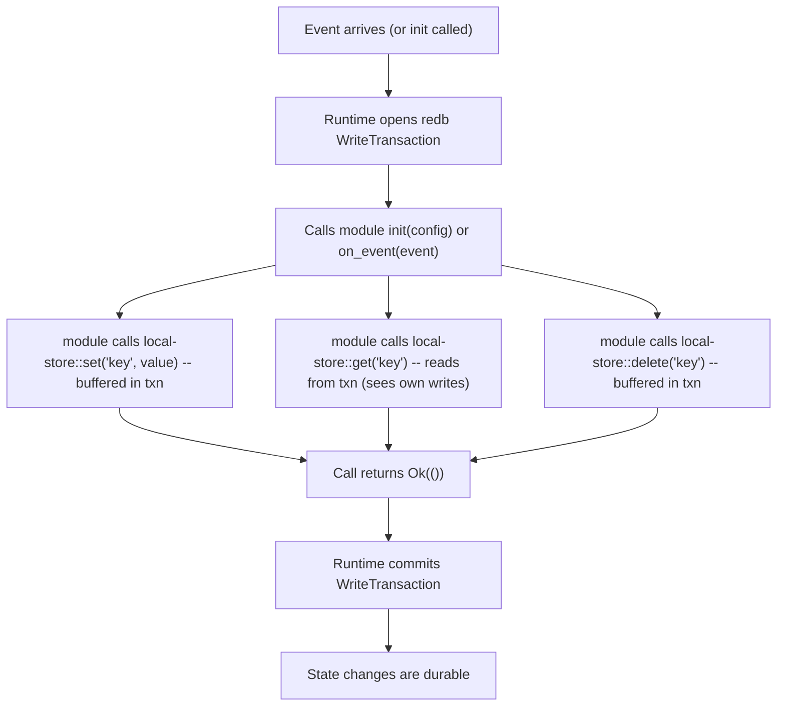
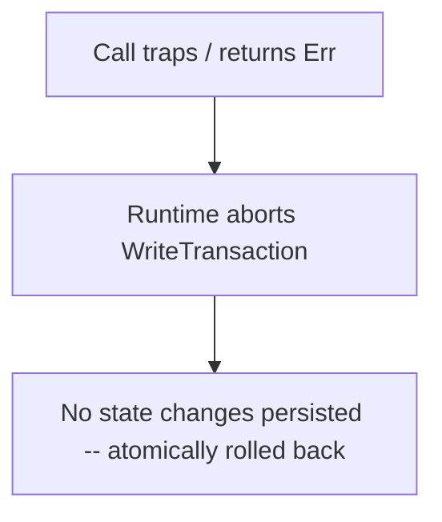

# Local Store Architecture

## Overview

Every nexum module has access to a persistent key-value store that survives restarts, crashes, and module updates. The store is backed by **redb** (v3.1, pure Rust, embedded, ACID, MVCC) and exposed to modules through the `local-store` WIT interface.

The local store is the only durable memory a module has — WASM linear memory is wiped on every restart. Modules must be written to reconstruct their working state from the store on `init`.

## redb Fundamentals

| Property | Detail |
|----------|--------|
| Engine | Copy-on-write B-tree |
| Concurrency | MVCC — concurrent readers, single writer, no blocking |
| Durability | Crash-safe by default (fsync on commit) |
| Transactions | Full ACID — read txns and write txns |
| Key types | `&str`, `&[u8]`, integers, tuples, `Option<T>`, fixed arrays |
| Value types | All key types + `Vec<T>`, `f32`/`f64`, `()` |
| Size | No hard limit; v3 file format starts at ~50 KiB |

## Isolation Model

Each module gets its own **redb database file**. Modules cannot read or write each other's state — enforced by filesystem-level separation.

```rust
// Runtime side — one database per module
fn open_module_db(module_id: &str) -> Result<Database> {
    let path = format!("/var/nexum/state/{module_id}.redb");
    Database::create(&path)
}

// Single table within each module's database
const LOCAL_STORE_TABLE: TableDefinition<&str, &[u8]> = TableDefinition::new("state");
```

Module identity = `name` from `nexum.toml`. If two module instances share a name, they share state (intentional — enables hot-reload with state continuity). Different modules have different names and fully isolated database files.

```
/var/nexum/state/
├── block-logger.redb      →  { "last_block": [...], "log_count": [...], ... }
├── price-alert.redb       →  { "thresholds": [...], ... }
└── rebalancer.redb        →  { "pending_orders": [...], ... }
```

This per-file design ensures concurrent modules never contend on write locks (see Concurrency section below).

## WIT Interface

```wit
interface local-store {
    /// Get a value by key. Returns none if key doesn't exist.
    get: func(key: string) -> result<option<list<u8>>, string>;

    /// Set a key-value pair. Overwrites existing value.
    set: func(key: string, value: list<u8>) -> result<_, string>;

    /// Delete a key. No-op if key doesn't exist.
    delete: func(key: string) -> result<_, string>;

    /// List keys matching a prefix. Returns keys only (not values).
    list-keys: func(prefix: string) -> result<list<string>, string>;
}
```

Keys are UTF-8 strings. Values are opaque bytes — the SDK provides typed wrappers (see doc 05).

`list-keys` enables prefix-based namespacing within a module's state:

```
orders/active/0x1234  →  [serialised order]
orders/active/0x5678  →  [serialised order]
orders/completed/…    →  [serialised order]

list_keys("orders/active/") → ["orders/active/0x1234", "orders/active/0x5678"]
```

## Transaction Semantics

Both `init` and `on_event` execute within an **implicit write transaction**:



**On failure** (trap, fuel exhaustion, explicit `Err`):



This gives us **all-or-nothing semantics per call**: either all state mutations from a single `init` or `on_event` callback are applied, or none are. This is critical for correctness — a module that crashes halfway through processing a block doesn't leave behind partial state. Equally, a failed `init` during restart doesn't corrupt state from the previous version.

### Read-your-own-writes

Within a single `on_event` call, a module sees its own uncommitted writes:

```rust
local_store::set("counter", &42u64.to_le_bytes())?;
let val = local_store::get("counter")?;
// val == Some([42, 0, 0, 0, 0, 0, 0, 0])  ✓
```

This works because all operations within one event go through the same `WriteTransaction`.

### Concurrency: One Database Per Module

redb allows only **one `WriteTransaction` at a time** per `Database` — a second `begin_write()` blocks until the first commits or aborts. Since modules dispatch events concurrently (doc 02), a single shared redb file would serialise all write transactions across modules, negating concurrency.

**Design decision:** each module gets its own redb `Database` file:

```
/var/nexum/state/
├── block-logger.redb
├── price-alert.redb
└── rebalancer.redb
```

This gives true write isolation — module A's transaction never blocks module B. The cost is more file handles (one per module), which is negligible for the expected module count.

Within a single module, events are already sequential (doc 02 dispatch semantics), so there is never contention on a module's own database.

## Size Enforcement

The manifest declares `max_state_bytes`. The runtime tracks total bytes stored per module and rejects `local-store::set` calls that would exceed the limit:

```rust
// Host-side enforcement (simplified)
impl local_store::Host for NexumHostState {
    async fn set(&mut self, key: String, value: Vec<u8>) -> Result<Result<(), String>> {
        let new_size = self.state_bytes_used
            - self.current_value_size(&key)
            + key.len() + value.len();

        if new_size > self.module_config.max_state_bytes {
            return Ok(Err("state quota exceeded".into()));
        }

        self.write_txn.insert(&*key, value.as_slice())?;
        self.state_bytes_used = new_size;
        Ok(Ok(()))
    }
}
```

The tracking is approximate (doesn't account for B-tree overhead) but sufficient for enforcing a meaningful cap.

## State Lifecycle

### Init / Cold Start

On first load, the module's table is empty. The module's `init` function should handle this:

```rust
fn init(config: Vec<(String, String)>) -> Result<(), String> {
    if local_store::get("initialized")?.is_none() {
        // First run — set up initial state
        local_store::set("initialized", &[1])?;
        local_store::set("last_block", &0u64.to_le_bytes())?;
    }
    Ok(())
}
```

### Restart (crash recovery)

On restart, the module gets a fresh WASM instance but the **same state table**. The last committed transaction's data is intact. Any in-flight transaction from the crashed event was rolled back.

The module should read its checkpoint from state in `init` and resume:

```rust
fn init(_config: Vec<(String, String)>) -> Result<(), String> {
    let last_block = local_store::get("last_block")?
        .map(|b| u64::from_le_bytes(b.try_into().unwrap()))
        .unwrap_or(0);
    logging::log(Level::Info, &format!("resuming from block {last_block}"));
    Ok(())
}
```

### Module Update (new version, same name)

When a module is updated (new WASM binary, same `name` in manifest), the new version inherits the existing state table. The new version's `init` is responsible for any migration:

```rust
fn init(config: Vec<(String, String)>) -> Result<(), String> {
    let version = local_store::get("schema_version")?
        .map(|b| u64::from_le_bytes(b.try_into().unwrap()))
        .unwrap_or(0);

    if version < 2 {
        // Migrate from v1 → v2 schema
        migrate_v1_to_v2()?;
        local_store::set("schema_version", &2u64.to_le_bytes())?;
    }
    Ok(())
}
```

### Module Removal

When an operator removes a module, its state table can optionally be:
- **Retained** (default) — in case the module is re-added later.
- **Purged** — operator explicitly requests deletion via CLI.

```bash
nexum state purge --module block-logger
```

## Backup and Compaction

redb supports online reads during writes (MVCC), so backup is straightforward:

```rust
// Runtime holds a read transaction, copies the file
let _guard = db.begin_read()?;
std::fs::copy("state.redb", "state.redb.backup")?;
```

Compaction (`db.compact()`) reclaims space from deleted keys. The runtime can run this periodically or on operator command.

## Host-Side Implementation Sketch

```rust
const LOCAL_STORE_TABLE: TableDefinition<&str, &[u8]> = TableDefinition::new("state");

struct ModuleStateCtx {
    db: Database,             // per-module database file
    max_bytes: usize,
    bytes_used: usize,
    write_txn: Option<WriteTransaction>,
}

impl ModuleStateCtx {
    /// Called by runtime before dispatching init or on_event
    fn begin(&mut self) -> Result<()> {
        self.write_txn = Some(self.db.begin_write()?);
        Ok(())
    }

    /// Called by runtime after successful return
    fn commit(&mut self) -> Result<()> {
        if let Some(txn) = self.write_txn.take() {
            txn.commit()?;
        }
        Ok(())
    }

    /// Called by runtime on failure/trap
    fn rollback(&mut self) {
        // WriteTransaction::drop aborts automatically
        self.write_txn.take();
    }

    fn table<'txn>(
        &self,
        txn: &'txn WriteTransaction,
    ) -> Result<Table<'txn, &str, &[u8]>> {
        txn.open_table(LOCAL_STORE_TABLE)
    }
}
```

## Summary

| Concern | Design |
|---------|--------|
| Backend | redb v3.1 (pure Rust, ACID, MVCC) |
| Isolation | One database file per module (keyed by `name`) |
| Key type | UTF-8 string |
| Value type | Opaque bytes (`list<u8>` in WIT) |
| Namespacing within module | Convention: slash-separated prefixes + `list-keys` |
| Transaction scope | Per `init` / `on_event` call — commit on success, rollback on failure |
| Read-your-own-writes | Yes (same `WriteTransaction`) |
| Size limit | Enforced per-module via manifest `max_state_bytes` |
| Survives restart | Yes — state is external to WASM instance |
| Module update | New version inherits state; `init` handles migration |
| Backup | Online copy under read transaction |
