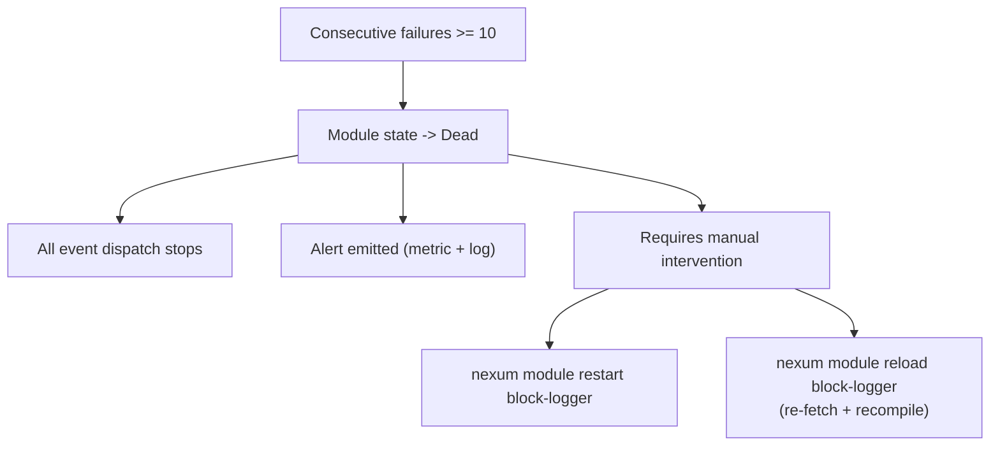
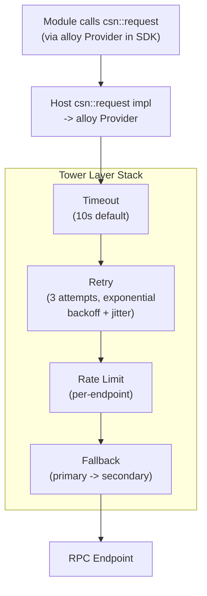
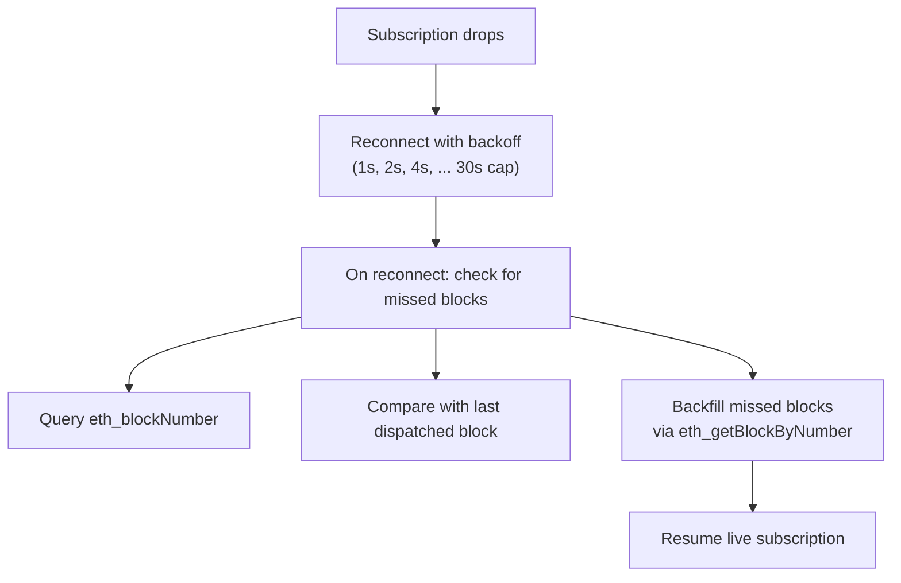

# Production Hardening & Observability

## Resource Enforcement

Four resource dimensions are capped per module, all driven by the manifest's `[module.resources]`:

### CPU: Fuel

Each `on_event` call is budgeted `max_fuel_per_event` fuel units. Exhaustion traps the call (state rolled back -- see doc 04). The budget prevents infinite loops and excessive computation.

```rust
store.set_fuel(module_config.max_fuel_per_event)?;
```

Fuel is deterministic -- the same WASM code consumes the same fuel regardless of host machine speed.

### CPU: Epoch (wall-clock)

A background Tokio task increments the engine epoch on a fixed interval (e.g. 100ms). Each module store has a deadline: if a callback exceeds N epochs, it yields back to the Tokio runtime. This prevents one module from starving others even if fuel is generous.

```rust
// Runtime startup
let engine = engine.clone();
tokio::spawn(async move {
    let mut interval = tokio::time::interval(Duration::from_millis(100));
    loop {
        interval.tick().await;
        engine.increment_epoch();
    }
});

// Per-module store setup
store.epoch_deadline_async_yield_and_update(10); // yield after 10 epochs (~1s)
```

### Memory

`ResourceLimiter` implementation caps linear memory growth:

```rust
impl ResourceLimiter for NexumHostState {
    fn memory_growing(
        &mut self,
        current: usize,
        desired: usize,
        maximum: Option<usize>,
    ) -> Result<bool> {
        let limit = self.module_config.max_memory_bytes;
        if desired > limit {
            tracing::warn!(
                module = %self.module_id,
                current, desired, limit,
                "memory growth denied"
            );
            Ok(false)
        } else {
            Ok(true)
        }
    }

    fn table_growing(
        &mut self,
        current: u32,
        desired: u32,
        maximum: Option<u32>,
    ) -> Result<bool> {
        Ok(desired <= 10_000) // sane default
    }
}
```

### Storage

Local-store quota (`max_state_bytes`) enforced in the `local-store::set` host function (see doc 04). Rejected with a clear error, not a trap -- the module can handle it gracefully.

### Summary

| Resource | Mechanism | Failure mode |
|----------|-----------|-------------|
| CPU (deterministic) | Fuel | Trap -> rollback -> restart |
| CPU (wall-clock) | Epoch interruption | Yield -> resume or trap |
| Memory | `ResourceLimiter` | `memory.grow` returns -1 |
| Storage | Host-side byte tracking | `local-store::set` returns `Err` |

## Crash Handling & Restart Policy

### Restart with Exponential Backoff

When a module's `on_event` (or `init`) traps or returns `Err`:

```
Attempt 1: restart after 1s
Attempt 2: restart after 2s
Attempt 3: restart after 4s
Attempt 4: restart after 8s
...
Attempt N: restart after min(2^(N-1), 300)s   <- capped at 5 minutes
```

A successful `on_event` resets the backoff counter to zero.

```rust
struct RestartPolicy {
    consecutive_failures: u32,
    max_backoff: Duration,      // 5 minutes
    base: Duration,             // 1 second
}

impl RestartPolicy {
    fn next_backoff(&self) -> Duration {
        let backoff = self.base * 2u32.saturating_pow(self.consecutive_failures - 1);
        backoff.min(self.max_backoff)
    }

    fn record_success(&mut self) {
        self.consecutive_failures = 0;
    }

    fn record_failure(&mut self) {
        self.consecutive_failures += 1;
    }
}
```

### Poison Pill Detection

A module that crashes on every event is a poison pill. After `max_consecutive_failures` (default: 10), the module transitions to `Dead` state:



The threshold is configurable per-module in the manifest under `[module.restart]` (separate from resource caps):

```toml
[module.restart]
max_consecutive_failures = 10
```

### Restart Scope

A restart creates a fresh `Store` (clean WASM memory) but reuses the `InstancePre` (no recompilation). The module's `init` is called again. Local-store data persists (doc 04).

## RPC Resilience

All RPC I/O flows through alloy providers configured by the runtime operator. The `csn::request` host function (see doc 07) forwards to the provider, which is wrapped with resilience layers using alloy's tower-based middleware.

### Provider Stack



### Operator Configuration

```toml
[[chains]]
chain_id = 42161
name = "arbitrum"

[[chains.csn]]
url = "wss://arb-mainnet.g.alchemy.com/v2/KEY"
priority = 1

[[chains.csn]]
url = "https://arb1.arbitrum.io/rpc"
priority = 2       # fallback

[chains.rpc_policy]
timeout_ms = 10_000
max_retries = 3
rate_limit_per_second = 50
```

### Subscription Reconnection

WebSocket subscriptions (`eth_subscribe`) drop when the connection is lost. The event source manager detects this and reconnects:



This ensures modules don't silently miss events during RPC outages.

## Structured Logging

### Stack: `tracing` + `tracing-subscriber`

All runtime logging uses the `tracing` crate with structured fields, output as JSON in production:

```rust
use tracing::{info, warn, error, instrument, Span};

#[instrument(skip(store), fields(module = %module_id, chain_id))]
async fn dispatch_event(module_id: &str, event: &Event, store: &mut Store<NexumHostState>) {
    info!(event_type = %event.type_name(), "dispatching event");
    // ...
}
```

### Log Contexts

Every log line includes:

| Field | Source |
|-------|--------|
| `module` | Module name from manifest |
| `chain_id` | Chain the event originated from |
| `event_type` | `block` / `logs` / `timer` |
| `block_number` | For block/log events |
| `level` | trace / debug / info / warn / error |
| `timestamp` | ISO 8601 |
| `span_id` | Tracing span (correlates related logs) |

### Module Guest Logs

When a module calls `logging::log(level, message)`, the host writes a `tracing` event tagged with the module's context:

```rust
impl logging::Host for NexumHostState {
    fn log(&mut self, level: Level, message: String) {
        let span = tracing::info_span!("module", module = %self.module_id);
        let _enter = span.enter();
        match level {
            Level::Trace => tracing::trace!("{message}"),
            Level::Debug => tracing::debug!("{message}"),
            Level::Info  => tracing::info!("{message}"),
            Level::Warn  => tracing::warn!("{message}"),
            Level::Error => tracing::error!("{message}"),
        }
    }
}
```

### Output Formats

| Environment | Format | Config |
|-------------|--------|--------|
| Development | Pretty, coloured | `RUST_LOG=nexum=debug` |
| Production | JSON, one line per event | `--log-format json` |

```json
{
  "timestamp": "2026-02-18T12:00:00.123Z",
  "level": "INFO",
  "module": "block-logger",
  "chain_id": 1,
  "event_type": "block",
  "block_number": 19000001,
  "message": "processed block",
  "span_id": "abc123"
}
```

## Metrics

### Stack: `metrics` crate + Prometheus exporter

The `metrics` crate provides a facade (like `log` for logging). We use `metrics-exporter-prometheus` to expose a `/metrics` HTTP endpoint.

> Note: The OpenTelemetry Prometheus exporter crate is deprecated. The `metrics` + `metrics-exporter-prometheus` combo remains the simplest, most stable path for Prometheus scraping.

### Metric Definitions

#### Runtime-level

| Metric | Type | Labels | Description |
|--------|------|--------|-------------|
| `nexum_modules_loaded` | Gauge | -- | Number of modules currently in Run state |
| `nexum_modules_dead` | Gauge | -- | Number of modules in Dead state |
| `nexum_uptime_seconds` | Counter | -- | Runtime uptime |
| `nexum_content_fetch_total` | Counter | `scheme` | Content store fetches by scheme |
| `nexum_content_fetch_errors` | Counter | `scheme` | Content store fetch failures |

#### Per-module

| Metric | Type | Labels | Description |
|--------|------|--------|-------------|
| `nexum_events_dispatched_total` | Counter | `module`, `event_type` | Events dispatched |
| `nexum_events_processed_total` | Counter | `module`, `event_type` | Events successfully processed |
| `nexum_events_failed_total` | Counter | `module`, `event_type` | Events that trapped or returned Err |
| `nexum_event_duration_seconds` | Histogram | `module`, `event_type` | Wall-clock time per on_event call |
| `nexum_fuel_consumed` | Histogram | `module` | Fuel consumed per on_event call |
| `nexum_restarts_total` | Counter | `module` | Total restart count |
| `nexum_consecutive_failures` | Gauge | `module` | Current consecutive failure count |
| `nexum_state_bytes_used` | Gauge | `module` | Current local-store usage in bytes |
| `nexum_memory_bytes_used` | Gauge | `module` | Current WASM linear memory size |

#### Per-chain RPC

| Metric | Type | Labels | Description |
|--------|------|--------|-------------|
| `nexum_rpc_requests_total` | Counter | `chain_id`, `method` | RPC calls made |
| `nexum_rpc_errors_total` | Counter | `chain_id`, `method`, `endpoint` | RPC errors |
| `nexum_rpc_duration_seconds` | Histogram | `chain_id`, `method` | RPC call latency |
| `nexum_rpc_fallbacks_total` | Counter | `chain_id` | Times a fallback endpoint was used |
| `nexum_subscription_reconnects_total` | Counter | `chain_id` | Subscription reconnection count |
| `nexum_blocks_behind` | Gauge | `chain_id` | Blocks behind head (0 = caught up) |

#### Identity

| Metric | Type | Labels | Description |
|--------|------|--------|-------------|
| `nexum_identity_sign_total` | Counter | `module`, `account` | Signing operations performed |
| `nexum_identity_errors_total` | Counter | `module`, `error_code` | Identity operation failures |

### Exposition

```toml
[metrics]
enabled = true
listen = "0.0.0.0:9090"
path = "/metrics"
```

```bash
curl http://localhost:9090/metrics
# HELP nexum_events_dispatched_total Events dispatched to modules
# TYPE nexum_events_dispatched_total counter
nexum_events_dispatched_total{module="block-logger",event_type="block"} 150234
```

## Health Checks

### HTTP Health Endpoint

```
GET /health -> 200 OK | 503 Service Unavailable
```

Response:

```json
{
  "status": "healthy",
  "uptime_seconds": 86400,
  "modules": {
    "block-logger": { "state": "running", "last_event_age_seconds": 2 },
    "price-alert": { "state": "running", "last_event_age_seconds": 5 }
  },
  "chains": {
    "1": { "connected": true, "head_block": 21500000, "blocks_behind": 0 },
    "42161": { "connected": true, "head_block": 19000500, "blocks_behind": 0 }
  }
}
```

Health is `unhealthy` if:
- Any required chain's RPC is disconnected.
- Any module is in `Dead` state.
- Last event age exceeds a configurable staleness threshold (suggests subscription dropped and backfill failed).

```toml
[health]
listen = "0.0.0.0:8080"
stale_event_threshold_seconds = 60
```

### Docker / Kubernetes

The health endpoint serves as the liveness probe. A readiness probe checks that at least one module is in `Run` state and all required chains are connected.

```yaml
livenessProbe:
  httpGet:
    path: /health
    port: 8080
  periodSeconds: 10
readinessProbe:
  httpGet:
    path: /health
    port: 8080
  initialDelaySeconds: 5
```

## Alerting Conditions

The runtime itself doesn't send alerts -- it exposes metrics and health for external systems (Prometheus + Alertmanager, Grafana, PagerDuty, etc). Recommended alert rules:

| Condition | Severity | Prometheus Expression |
|-----------|----------|-----------------------|
| Module entered Dead state | Critical | `nexum_modules_dead > 0` |
| High event failure rate | Warning | `rate(nexum_events_failed_total[5m]) / rate(nexum_events_dispatched_total[5m]) > 0.1` |
| Event processing latency spike | Warning | `histogram_quantile(0.99, nexum_event_duration_seconds) > 5` |
| RPC endpoint down | Critical | `nexum_rpc_errors_total` sustained increase with no successes |
| Chain falling behind | Warning | `nexum_blocks_behind > 10` |
| State store near quota | Warning | `nexum_state_bytes_used / nexum_state_bytes_limit > 0.9` |
| Subscription reconnect storm | Warning | `rate(nexum_subscription_reconnects_total[5m]) > 1` |
| Identity signing failures | Warning | `rate(nexum_identity_errors_total[5m]) > 0.5` |

## Runtime Configuration Summary

```toml
# -- Logging --
[logging]
format = "json"             # "json" | "pretty"
level = "info"              # default filter level
module_level = "debug"      # filter for module guest logs

# -- Metrics --
[metrics]
enabled = true
listen = "0.0.0.0:9090"
path = "/metrics"

# -- Health --
[health]
listen = "0.0.0.0:8080"
stale_event_threshold_seconds = 60

# -- Epoch ticker --
[runtime]
epoch_interval_ms = 100
epoch_deadline = 10          # epochs before yield (~1s)

# -- Global resource defaults (overridden by per-module manifest) --
[runtime.defaults.resources]
max_memory_bytes = 10_485_760
max_fuel_per_event = 100_000
max_state_bytes = 52_428_800

# -- Global restart defaults --
[runtime.defaults.restart]
max_consecutive_failures = 10
```

## Deployment: Docker

```dockerfile
FROM rust:1.90-slim AS builder
WORKDIR /build
COPY . .
RUN cargo build --release --bin nexum

FROM debian:bookworm-slim
COPY --from=builder /build/target/release/nexum /usr/local/bin/
EXPOSE 8080 9090
ENTRYPOINT ["nexum", "--config", "/etc/nexum/config.toml"]
```

```bash
docker run -d \
  -v /etc/nexum:/etc/nexum \
  -v /var/nexum:/var/nexum \
  -p 8080:8080 \
  -p 9090:9090 \
  nexum:latest
```

Volumes:
- `/etc/nexum/` -- runtime config, module manifests.
- `/var/nexum/` -- local-store (`state.redb`), content cache, logs.

## Operational Runbook (CLI)

```bash
# List loaded modules and their state
nexum module list

# Restart a dead or failed module
nexum module restart block-logger

# Reload a module (re-fetch wasm, recompile)
nexum module reload block-logger

# Purge a module's local-store
nexum state purge --module block-logger

# Compact the state database
nexum state compact

# Check runtime health
nexum health

# Dump metrics
nexum metrics
```
